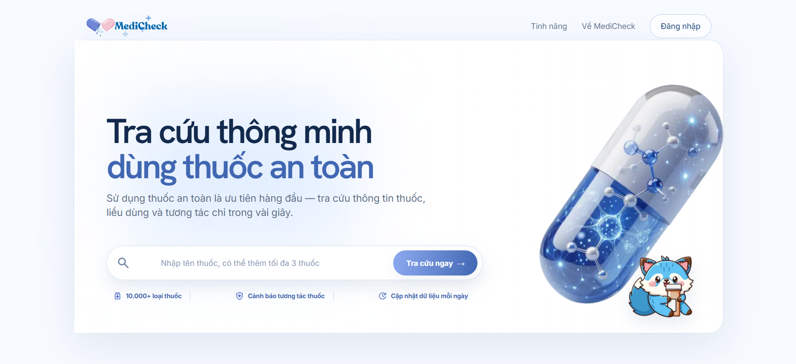
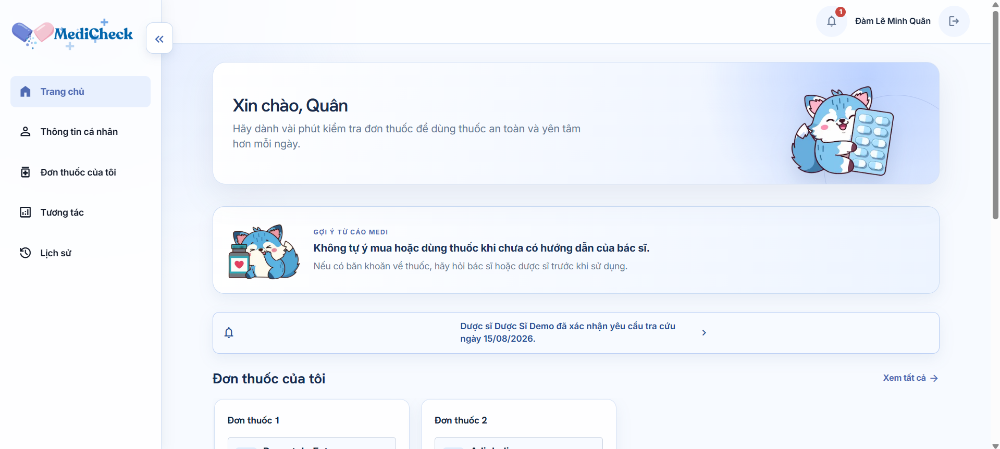
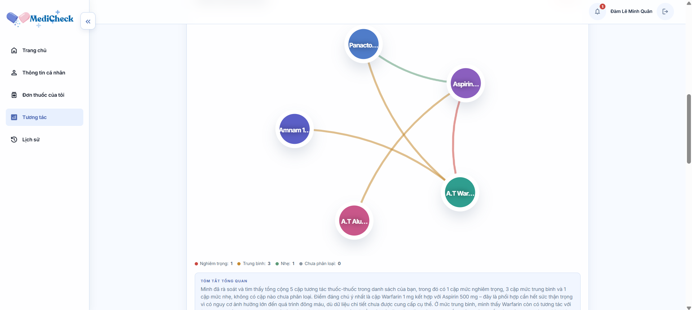
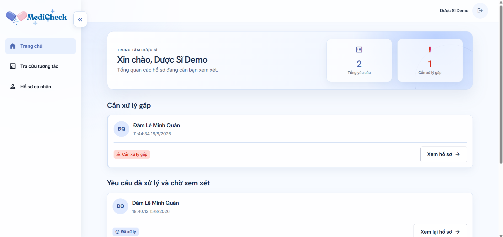

# 🛡️ MediCheck

> AI Agent kiểm tra tương tác thuốc & cảnh báo an toàn dùng thuốc cho bệnh nhân và dược sĩ, dựa trên dữ liệu thật **DDInter 2.0**.

Bệnh nhân dùng nhiều thuốc/thực phẩm chức năng cùng lúc dễ gặp tương tác nguy hiểm mà không biết. MediCheck nhận danh sách thuốc (gõ tay hoặc chụp ảnh đơn thuốc), chuẩn hóa tên, tra cứu tương tác qua CSDL **DDInter 2.0 thật**, xếp hạng mức độ nghiêm trọng, giải thích bằng tiếng Việt kèm trích dẫn nguồn — và luôn có dược sĩ xác nhận (HITL) trước khi coi là đáng tin.

Hệ thống kiểm tra **3 loại tương tác**, số liệu CSDL production (01/09/2026):

| Loại | Bảng | Số bản ghi |
|---|---|---:|
| Thuốc – thuốc (chạy trong LangGraph agent) | `interactions` | 160.227 cặp |
| Thuốc – thực phẩm | `food_interactions` | 803 |
| Thuốc – bệnh nền | `disease_interactions` | 7.672 (trên 450 bệnh) |
| Biệt dược Việt Nam → hoạt chất | `products` / `product_ingredients` | 41.302 / 68.562 |
| Danh mục hoạt chất | `medications` | 2.073 (1.939 có ít nhất 1 cặp tương tác) |

**AI không tự chẩn đoán, không tự khuyên đổi/ngừng thuốc — mọi cảnh báo chỉ mang tính tham khảo.**

Xem cách cài đặt và khởi động hệ thống tại [Hướng dẫn chạy](HUONG_DAN_CHAY.md).

## Screenshot

| Landing page | Dashboard bệnh nhân |
|---|---|
|  |  |

| Kết quả kiểm tra tương tác | Dashboard dược sĩ |
|---|---|
|  |  |

## Tech Stack

| Layer | Công nghệ |
|---|---|
| Agent | LangGraph, 5 node tất định (chuẩn hóa → tra cứu → xếp hạng → gắn dữ liệu → guardrail) — không node nào gọi LLM, nên mọi cặp tương tác luôn đến từ CSDL |
| LLM | DeepSeek-chat (`langchain-openai` trỏ base_url DeepSeek), chạy **sau** agent ở tầng service: giải thích cấp thuốc, tổng quan, thực phẩm & bệnh nền |
| Backend | FastAPI + Uvicorn + SQLAlchemy |
| Database | Postgres (DB chính); tuỳ chọn tách 3 bảng tra cứu sang 1 DB Postgres-compatible riêng khi cần, xem [`docs/database-split.md`](docs/database-split.md); SQLite `data/app.db` cho dev offline |
| Dữ liệu tương tác | DDInter 2.0 thật (thuốc–thuốc, thuốc–thực phẩm, thuốc–bệnh nền), không phải mô phỏng |
| Frontend | Next.js 14 (App Router) + TypeScript, 3 vai trò (bệnh nhân / dược sĩ / admin) |
| Testing | pytest + pytest-asyncio + httpx (65 test) |
| CI/CD | GitHub Actions → Render (backend) + Vercel (frontend) |

## Cài đặt & Chạy

Setup bằng **Docker** — không cần cài Python/Node trên máy, chỉ cần Docker. Chạy được trên **Windows, macOS, Linux**.

### 0. Cài Docker

- **Windows**: cài [Docker Desktop](https://www.docker.com/products/docker-desktop/), bật WSL2 backend khi được hỏi (mặc định).
- **macOS**: cài [Docker Desktop](https://www.docker.com/products/docker-desktop/).
- **Linux**: cài [Docker Engine](https://docs.docker.com/engine/install/) + plugin Compose.

Kiểm tra đã cài đúng:

```bash
docker --version
docker compose version
```

### 1. Lấy code

```bash
git clone <repo-url>
cd MediCheck
```

### 2. Chuẩn bị dữ liệu

CSDL không nằm trong git. Chọn **một** trong hai cách:

- **Dùng PostgreSQL** — điền `DATABASE_URL` và, nếu dùng cơ sở dữ liệu facts riêng,
  `DATABASE_URL_FACTS` ở bước 3. Lý do tách 2 DB: [`docs/database-split.md`](docs/database-split.md).
- **Dev offline bằng SQLite** — xin file `data/app.db` (~740MB, đã seed sẵn toàn bộ DDInter
  2.0 + biệt dược Việt Nam) qua kênh riêng, copy vào đúng đường dẫn `data/app.db` (cùng cấp
  với `Dockerfile`), rồi đặt `DATABASE_URL=sqlite:///./data/app.db` và **để trống**
  `DATABASE_URL_FACTS`.

Không có dữ liệu, backend vẫn khởi động được nhưng mọi tra cứu thuốc sẽ trả "không có dữ liệu".

Muốn dựng lại `data/app.db` từ dữ liệu gốc thay vì xin file: đặt các dump DDInter vào
`data/raw/` rồi chạy [`scripts/import_ddinter.py`](scripts/import_ddinter.py),
[`scripts/import_ddinter_dfi_ddsi.py`](scripts/import_ddinter_dfi_ddsi.py),
[`scripts/import_products.py`](scripts/import_products.py).

### 3. Tạo file cấu hình `.env`

```bash
cp .env.example .env
```

Điền các biến bắt buộc — xem bảng đầy đủ ở mục [Environment Variables](#environment-variables) bên dưới.

### 4. Build & chạy toàn bộ hệ thống

```bash
docker compose up --build
```

Build 2 image (backend FastAPI, frontend Next.js) và chạy cùng lúc.
Chạy nền (không giữ terminal): thêm `-d`.

### 5. Kiểm tra đã chạy đúng

- Backend health check: [http://localhost:8000/health](http://localhost:8000/health) → phải thấy `{"status":"ok",...}`.
- Swagger UI: [http://localhost:8000/docs](http://localhost:8000/docs).
- Frontend: [http://localhost:3000](http://localhost:3000).

### 6. Dừng hệ thống

```bash
docker compose down
```

Không xóa `data/app.db` (được mount từ máy thật qua volume).

## Environment Variables

Chỉ liệt kê tên biến — giá trị thật nằm trong `.env` (không commit vào git).

| Biến | Bắt buộc | Mô tả |
|---|:---:|---|
| `DEEPSEEK_API_KEY` | ✅ | API key DeepSeek (free tại [platform.deepseek.com](https://platform.deepseek.com)). Không có key này, các cặp thuốc mức nhẹ/trung bình/nặng sẽ không sinh được giải thích (agent cần gọi LLM thật). |
| `DEEPSEEK_BASE_URL` | — | Mặc định `https://api.deepseek.com`, không cần đổi. |
| `MODEL_NAME` | — | Mặc định `deepseek-chat`. |
| `DATABASE_URL` | ✅ | DB chính (users, products, lịch sử kiểm tra…). Mặc định `sqlite:///./data/app.db`. |
| `DATABASE_URL_FACTS` | — | DB tra cứu (`interactions`, `food_interactions`, `disease_interactions`), tuỳ chọn tách riêng. Để trống → dùng chung `DATABASE_URL` (mặc định, đúng cho 1 Postgres/SQLite local duy nhất). Xem [`docs/database-split.md`](docs/database-split.md). |
| `SECRET_KEY` | ✅ (khi deploy thật) | Secret ký JWT (`src/services/auth.py`). Có giá trị dev mặc định, **phải đổi trước khi deploy public**. |
| `APP_ENV` | — | `development` / `production` / `test`. |
| `APP_PORT`, `APP_HOST` | — | Mặc định `8000` / `0.0.0.0`. |
| `CORS_ORIGINS` | — | Domain frontend được phép gọi API. |
| `FRONTEND_URL` | ✅ | URL frontend dùng trong liên kết xác minh email/đặt lại mật khẩu. |
| `GOOGLE_CLIENT_ID`, `NEXT_PUBLIC_GOOGLE_CLIENT_ID` | ✅ | Web Client ID của Google Identity Services; hai phía phải dùng cùng giá trị. |
| `SMTP_HOST`, `SMTP_PORT`, `SMTP_USERNAME`, `SMTP_PASSWORD`, `SMTP_FROM` | ✅ | SMTP gửi email xác minh và đặt lại mật khẩu. |
| `SMTP_STARTTLS`, `SMTP_SSL` | — | Chỉ bật một chế độ: STARTTLS thường dùng cổng 587, SSL trực tiếp thường dùng cổng 465. |
| `SMTP_TIMEOUT_SECONDS`, `SMTP_MAX_RETRIES`, `SMTP_RETRY_DELAY_SECONDS` | — | Timeout và retry gửi email; mặc định 15 giây, 3 lần, delay 1 giây. |
| `COOKIE_SECURE`, `COOKIE_SAMESITE`, `COOKIE_DOMAIN` | ✅ production | Chính sách cookie phiên; dùng `Secure=true`, và `SameSite=none` nếu frontend/API khác site. |
| `ENABLE_DEMO_ACCOUNTS` | — | Hai nút demo luôn hiển thị; đặt `true` để backend cho phép đăng nhập các tài khoản demo. |
| `GMAIL_OAUTH_CLIENT_ID`, `GMAIL_OAUTH_CLIENT_SECRET`, `GMAIL_OAUTH_REFRESH_TOKEN` | ✅ trên Render | Gửi email qua Gmail API thay SMTP (Render chặn SMTP ra ngoài). Cách lấy: [`docs/gmail-api-setup.md`](docs/gmail-api-setup.md). Có refresh token thì các biến `SMTP_*` không cần nữa. |
| `LLM_TEMPERATURE` | — | Mặc định `0.3`. |
| `LOG_LEVEL` | — | `DEBUG` / `INFO` / `WARNING` / `ERROR`. |

### Thiết lập xác thực production

1. Tạo OAuth Client loại **Web application** trong Google Cloud, cấu hình consent screen và thêm `http://localhost:3000` cùng domain production vào **Authorized JavaScript origins**.
2. Điền Google Client ID và cấu hình email trong `.env` — SMTP cho local, Gmail API cho production vì Render chặn SMTP ([`docs/gmail-api-setup.md`](docs/gmail-api-setup.md)). Không cần Google Client Secret cho luồng Sign in with Google bằng ID token.
3. Sao lưu database (hoặc tạo bản sao/nhánh riêng) rồi chạy `python scripts/migrate_auth.py`. Migration chuẩn hóa email, giữ nguyên dữ liệu liên quan và khóa tài khoản cũ không phải demo.
4. Tạo quản trị viên đầu tiên bằng `python scripts/create_admin.py --email admin@example.com --name "Admin"`.
5. Production phải chạy HTTPS, dùng `SECRET_KEY` ngẫu nhiên mạnh, `COOKIE_SECURE=true`, và CORS chỉ chứa domain frontend chính xác.

Frontend không lưu credential trong `localStorage`; access/refresh session nằm trong cookie HttpOnly. Tài khoản email phải bấm link xác minh, còn tài khoản dược sĩ chỉ được cấp quyền sau khi admin duyệt số CCHN và nơi công tác.

### Smoke test auth trên staging

Sau khi deploy backend, migrate database và tạo một tài khoản staging đang hoạt động, đặt các biến môi trường cục bộ rồi chạy:

```powershell
$env:STAGING_API_URL="https://api-staging.example.com"
$env:STAGING_FRONTEND_URL="https://staging.example.com"
$env:SMOKE_AUTH_EMAIL="staging-user@example.com"
$env:SMOKE_AUTH_PASSWORD="<password>"
$env:SMOKE_CROSS_SITE="true"
python scripts/smoke_auth_staging.py
```

Script kiểm tra health, CORS, CSRF, cookie `HttpOnly/Secure/SameSite`, đăng nhập, `/me`, xoay refresh token, chống dùng lại refresh cũ và logout. Google popup và email thật vẫn cần kiểm tra thủ công trên HTTPS: đăng ký một email mới, mở link xác minh nhận qua SMTP, đăng nhập Google thật và xác nhận đúng trang đích theo vai trò.

## Sample Queries

Endpoint không cần đăng nhập, dùng để thử nhanh — `POST /api/v1/guest/medications/check` (nhận thẳng tên hoạt chất/tên gốc, tự chuẩn hóa qua alias):

```bash
curl -X POST http://localhost:8000/api/v1/guest/medications/check \
  -H "Content-Type: application/json" \
  -d '{"medications": ["Aspirin", "Warfarin"]}'
```

Luồng theo tên biệt dược thật (Vietnamese brand name) — `POST /api/v1/guest/products/check`:

```bash
curl -X POST http://localhost:8000/api/v1/guest/products/check \
  -H "Content-Type: application/json" \
  -d '{
    "prescriptions": [
      {"label": "Đơn thuốc 1", "products": ["Aspirin 81", "A.T Warfarin 1 mg"]}
    ]
  }'
```

Tìm kiếm/autocomplete tên biệt dược:

```bash
curl "http://localhost:8000/api/v1/guest/products/search?q=aspirin"
```

## Kiểm thử

```bash
# 65 test: agent core, API, services — dùng SQLite riêng, mock LLM, không gọi API thật
APP_ENV=test DEEPSEEK_API_KEY=test-key DATABASE_URL=sqlite:///./ci_test.db   pytest tests/ -q

ruff check src/ tests/
```

Cùng 2 lệnh này chạy trong CI mỗi lần push ([`.github/workflows/ci.yml`](.github/workflows/ci.yml))
và chặn deploy nếu fail.

## Cấu trúc dự án

```
src/
├── agents/
│   ├── graph.py, state.py        # LangGraph: 5 node nối tiếp
│   ├── nodes/                    # normalize → lookup → rank → explain → guardrail
│   └── tools/                    # drug_normalizer, interaction_lookup, severity_ranker
├── api/
│   ├── routes.py                 # endpoint nghiệp vụ /api/v1/*
│   ├── auth_routes.py            # đăng nhập/đăng ký + nhóm endpoint /admin/*
│   └── deps.py                   # auth dependency (get_current_user, require_role)
├── db/
│   ├── models.py                 # SQLAlchemy: users, medications, interactions, ...
│   └── session.py                # 2 engine: DB chính + facts DB (tuỳ chọn tách riêng)
├── models/schemas.py              # Pydantic request/response
├── services/
│   ├── auth.py, email.py          # phiên đăng nhập, email xác minh (SMTP / Gmail API)
│   ├── llm.py, tone_prompt.py     # gọi DeepSeek + prompt an toàn theo vai trò người đọc
│   ├── food_disease_lookup.py     # tương tác thuốc–thực phẩm / thuốc–bệnh nền (ngoài agent)
│   ├── food_disease_explain.py, rollup_explain.py  # gộp kết quả theo thuốc/đơn/tổng quan
│   └── explanation_cache.py, disease_search.py, vector_store.py
├── config.py, main.py
scripts/                           # ETL DDInter, migrate DB, seed demo
frontend/                          # Next.js App Router: (patient)/(pharmacist)/admin
tests/                             # pytest — agent core, API, services
docs/                              # tài liệu kiến trúc, cấu hình và ảnh giao diện
```

## API chính (`/api/v1`)

| Method | Path | Vai trò | Mô tả |
|---|---|---|---|
| POST | `/auth/register`, `/auth/login` | công khai | Đăng ký/đăng nhập |
| GET | `/products/search`, `/guest/products/search?q=` | công khai/đã đăng nhập | Autocomplete tên biệt dược |
| POST | `/products/check` | bệnh nhân | Chạy agent, lưu kết quả, trả về (ẩn field dược sĩ) |
| POST | `/guest/products/check` | công khai | Chạy agent, không lưu, không cần đăng nhập |
| GET | `/patients/{id}/checks[/{check_id}]` | bệnh nhân | Lịch sử kiểm tra |
| GET/POST | `/pharmacist/requests`, `/pharmacist/reviews` | dược sĩ | Danh sách yêu cầu, xem đầy đủ (có `xu_tri`) + xác nhận |
| GET/PUT | `/diseases/search`, `/patients/{id}/conditions` | bệnh nhân | Bệnh nền của bệnh nhân (dùng để lọc cảnh báo thuốc–bệnh) |
| GET/POST | `/admin/overview`, `/admin/users`, `/admin/pharmacists/pending`, `/admin/feedback` | admin | Duyệt tài khoản dược sĩ (CCHN), quản lý người dùng, dữ liệu thuốc, phản hồi |

Danh sách endpoint đầy đủ + request/response schema: [http://localhost:8000/docs](http://localhost:8000/docs) (Swagger, tự sinh từ code).

## Demo (MVP)

Xem video giới thiệu và quy trình hoạt động các luồng tra cứu trên YouTube:

[](https://youtu.be/844Ecl_U9LQ?si=ImpH3Ft8t3XGg8lT)

### 🎬 Nội dung video

- [00:00](https://www.youtube.com/watch?v=844Ecl_U9LQ) — Giới thiệu bài toán & MediCheck
- [00:34](https://www.youtube.com/watch?v=844Ecl_U9LQ&t=34s) — Luồng dành cho bệnh nhân
- [01:55](https://www.youtube.com/watch?v=844Ecl_U9LQ&t=115s) — Luồng dành cho dược sĩ
- [02:33](https://www.youtube.com/watch?v=844Ecl_U9LQ&t=153s) — Hồ sơ, lịch sử & thông báo
- [02:55](https://www.youtube.com/watch?v=844Ecl_U9LQ&t=175s) — Human-in-the-Loop & nguyên tắc an toàn
- [03:36](https://www.youtube.com/watch?v=844Ecl_U9LQ&t=216s) — Hướng phát triển MediCheck

## Live URL

**https://ai20k-c3-team005-medicheck.vercel.app**

Frontend Next.js trên Vercel, proxy `/api/*` sang backend FastAPI (xem `frontend/next.config.js`).
Dùng thử ngay không cần đăng ký: trang chủ → ô tra cứu khách (guest), nhập 2 biệt dược bất kỳ.

Thử nhanh bằng curl qua chính domain production:

```bash
curl "https://ai20k-c3-team005-medicheck.vercel.app/api/v1/guest/products/search?q=aspirin"

curl -X POST https://ai20k-c3-team005-medicheck.vercel.app/api/v1/guest/medications/check \
  -H "Content-Type: application/json" \
  -d '{"medications": ["Aspirin", "Warfarin"]}'
```

> ⏱️ Backend chạy free tier nên **request đầu tiên sau một thời gian không dùng có thể mất 30-60 giây**
> (cold start); các request sau trả về dưới 1 giây. Nếu trang báo lỗi tải ở lần vào đầu tiên, tải lại sau ít phút.

Muốn chạy local thay vì dùng bản deploy: xem mục [Cài đặt & Chạy](#cài-đặt--chạy) ở trên.

## License

MIT (mã nguồn) — dữ liệu DDInter 2.0 dùng cho mục đích học thuật/giáo dục.
