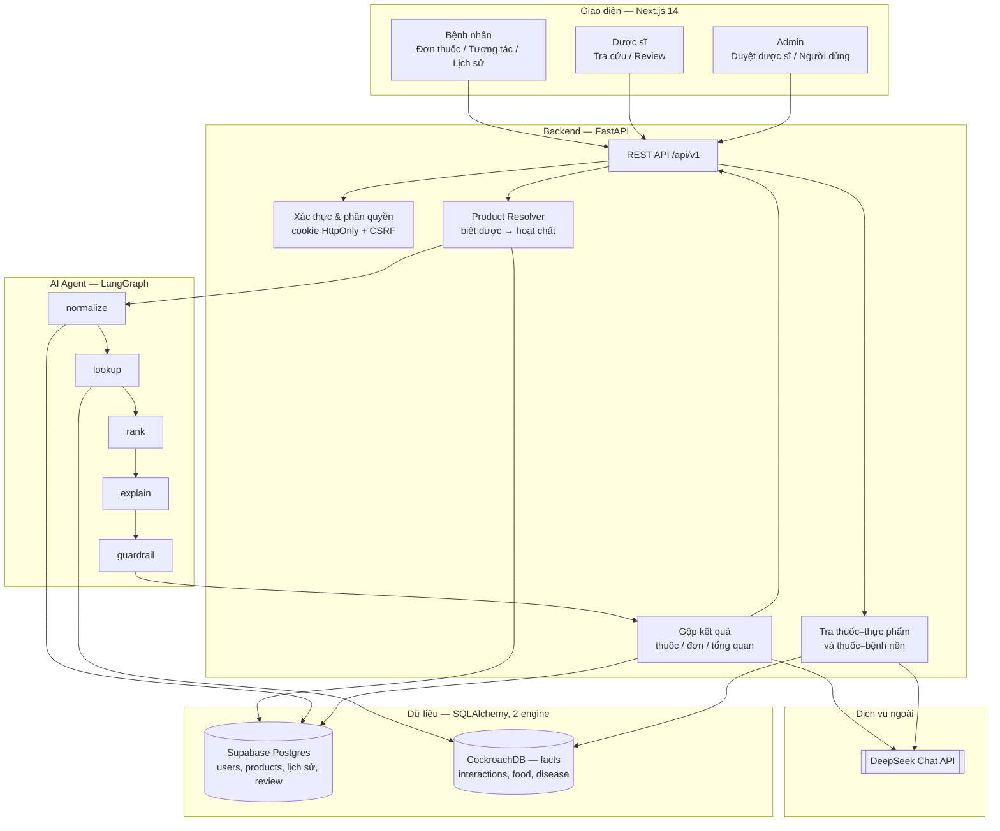
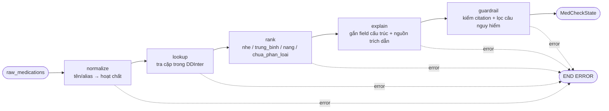
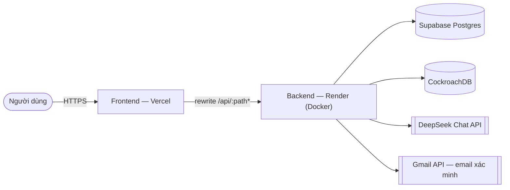

# Kiến trúc hệ thống — MediCheck

> Deliverable #3. Sơ đồ hệ thống + mô tả thành phần. Số liệu và tên dịch vụ trong tài
> (cập nhật 01/09/2026).

MediCheck nhận danh sách thuốc (gõ tên biệt dược/hoạt chất), phân giải biệt dược → hoạt
chất, rồi chạy **LangGraph agent 5 node** để chuẩn hóa, tra cứu DDInter 2.0, xếp hạng mức
độ và gắn nguồn trích dẫn.

**Cả 5 node đều tất định — không node nào gọi LLM.** Đây là lựa chọn có chủ đích: tương
tác thuốc là dữ liệu y khoa, sai một cặp là nguy hiểm thật, nên mọi cặp tương tác đều đến
từ CSDL chứ không do model sinh ra. LLM chỉ vào cuộc **sau** agent, ở tầng service, để
diễn giải phần dữ liệu đã tra được — cùng lúc với việc tra **tương tác thuốc–thực phẩm**
và **thuốc–bệnh nền** bằng SQL thuần. Mọi đoạn LLM viết đều đi qua bộ lọc an toàn y tế,
rồi được gộp theo thuốc/đơn/tổng quan, lưu lại cho bệnh nhân và đưa vào hàng đợi để
**dược sĩ xác nhận** (human-in-the-loop).

## 1. Sơ đồ hệ thống

## 2. Thành phần chính

| Thành phần | Công nghệ | Vai trò | Vị trí |
|---|---|---|---|
| Frontend | Next.js 14 App Router + TypeScript | 3 vai trò (bệnh nhân / dược sĩ / admin), session bằng cookie HttpOnly | [`frontend/`](../frontend/) |
| Backend API | FastAPI + Uvicorn + Pydantic | REST `/api/v1`, xác thực, phân quyền, điều phối agent | [`src/api/routes.py`](../src/api/routes.py) |
| AI Agent | LangGraph + LangChain | Pipeline 5 node cho tương tác thuốc–thuốc | [`src/agents/graph.py`](../src/agents/graph.py) |
| Agent tools | Python + SQLAlchemy | `drug_normalizer`, `interaction_lookup`, `severity_ranker` | [`src/agents/tools/`](../src/agents/tools/) |
| Thuốc–thực phẩm / thuốc–bệnh nền | SQL thuần, chạy ngoài agent | Tra theo từng hoạt chất; lọc theo bệnh nền đã khai của bệnh nhân | [`src/services/food_disease_lookup.py`](../src/services/food_disease_lookup.py) |
| LLM | DeepSeek-chat qua `langchain-openai` | Chỉ **diễn giải** dữ liệu đã tra được, không tự sinh dữ liệu tương tác | [`src/services/llm.py`](../src/services/llm.py) |
| Database | Supabase Postgres + CockroachDB | 22 bảng, xem §4 | [`src/db/`](../src/db/) |

## 3. Pipeline AI Agent

Mỗi node ghi kết quả vào `MedCheckState` ([`src/agents/state.py`](../src/agents/state.py)).
Node nào set `error` thì graph dừng sớm — agent **không bịa** tương tác khi thiếu dữ liệu
mà trả cờ báo thiếu.

Cả 5 node đều tất định: `normalize`/`lookup` là truy vấn SQL, `rank` là bảng ánh xạ mức
độ, `explain` chỉ gắn field cấu trúc và `mo_ta_dich` (bản dịch nguyên văn đã lưu sẵn trong
CSDL), `guardrail` là regex. Giải thích ở cấp hoạt chất trước đây do LLM sinh, nhưng nó
chưa từng hiển thị ở luồng nào — chỉ dùng làm dữ liệu dựng đồ thị — nên đã cắt bỏ để khỏi
tốn một lượt gọi LLM cho **mỗi cặp** hoạt chất.

Guardrail chặn đoạn giải thích không có `nguon_trich_dan` và lọc ngôn ngữ khuyên tự ý
đổi/ngừng/chỉnh liều. Hàm lọc `filter_banned_language()` định nghĩa trong `guardrail_node`
nhưng được [`rollup_explain.py`](../src/services/rollup_explain.py) và
[`food_disease_explain.py`](../src/services/food_disease_explain.py) import dùng lại cho
văn bản do LLM sinh ở tầng service — nên guardrail vẫn phủ đúng chỗ AI thực sự viết chữ.
Lọc theo từng câu, chỉ thay cả đoạn bằng câu trung lập khi mọi câu đều vi phạm.

## 4. Dữ liệu

Hai engine SQLAlchemy, tách vì 3 bảng tra cứu chiếm >95% dung lượng và vượt quota 0.5 GB
của Supabase free tier — chi tiết ở [`database-split.md`](database-split.md).

| Engine | Biến môi trường | Nội dung |
|---|---|---|
| Chính | `DATABASE_URL` — Supabase Postgres | `users`, `patient_profiles`, `patient_conditions`, `products`, `medications`, `patient_prescriptions`, `interaction_checks`, `pharmacist_reviews`, `notifications`, cache giải thích, `feedback_reports`… |
| Facts | `DATABASE_URL_FACTS` — CockroachDB | `interactions`, `food_interactions`, `disease_interactions` |

Số liệu production (01/09/2026):

| Dữ liệu | Bản ghi |
|---|---:|
| Tương tác thuốc–thuốc (DDInter 2.0) | 160.227 cặp |
| Tương tác thuốc–bệnh nền | 7.672 (trên 450 bệnh) |
| Tương tác thuốc–thực phẩm | 803 |
| Biệt dược Việt Nam → hoạt chất | 41.302 / 68.562 |
| Danh mục hoạt chất | 2.073 |

Trong 2.073 hoạt chất của danh mục, **1.939** có ít nhất một cặp tương tác. 134 hoạt chất
còn lại (thuốc nhỏ mắt, vaccine, chất chẩn đoán như `Sulfur hexafluoride`) không có dòng
nào ở cả ba bảng — DDInter không xây dữ liệu tương tác toàn thân cho nhóm này, nên agent
trả cờ "không đủ dữ liệu" thay vì suy đoán.

ETL: [`scripts/import_ddinter.py`](../scripts/import_ddinter.py),
[`import_ddinter_dfi_ddsi.py`](../scripts/import_ddinter_dfi_ddsi.py),
[`import_products.py`](../scripts/import_products.py).
SQLite (`data/app.db`) vẫn dùng được cho dev offline khi để trống `DATABASE_URL_FACTS`.

## 5. Luồng một lần kiểm tra

1. Người dùng nhập biệt dược/hoạt chất.
2. Backend kiểm tra quyền, phân giải biệt dược → hoạt chất (`products` / `product_ingredients`).
3. Agent chạy 5 node, trả về kết quả có cấu trúc: cặp tương tác, mức độ, mô tả gốc và
   nguồn trích dẫn — chưa có câu chữ nào do AI viết.
4. Sau agent, LLM mới vào cuộc: giải thích cấp thuốc, tóm tắt tổng quan, thuốc–thực phẩm
   và thuốc–bệnh nền. Mọi đoạn sinh ra đều qua `filter_banned_language()` trước khi trả về.
5. Gộp kết quả theo hoạt chất → thuốc → đơn → tổng quan (`asyncio.gather` cho 4 nhánh LLM).
6. Luồng bệnh nhân: lưu `interaction_checks`; bệnh nhân có thể gửi yêu cầu dược sĩ xác nhận.
7. Dược sĩ xem bản đầy đủ (có `xu_tri`, thuốc thay thế), xác nhận + ghi chú → bệnh nhân nhận thông báo.

## 6. Triển khai

- Trình duyệt **không** gọi thẳng backend: `frontend/next.config.js` rewrite `/api/:path*`
  ở tầng server nên production chỉ lộ một origin, cookie phiên là same-site.
- Backend chạy free tier → **request đầu sau thời gian nghỉ mất 30–60 giây** (cold start),
  các request sau dưới 1 giây.
- CI: mọi push/PR chạy ruff + pytest trên self-hosted runner của BTC
  ([`.github/workflows/ci.yml`](../.github/workflows/ci.yml)).
- CD: build image lên GHCR + deploy hook Render + `vercel deploy --prod`
  ([`.github/workflows/cd.yml`](../.github/workflows/cd.yml)). Auto-deploy theo push
  **đang tắt** — chạy tay bằng "Run workflow" trong tab Actions để tránh deploy ngoài ý muốn.
- Local: `docker compose up --build` chạy `frontend` (:3000) và `backend` (:8000).

## 7. An toàn & bảo mật

- Phiên đăng nhập: JWT trong cookie `HttpOnly` (access + refresh có xoay vòng), kèm CSRF
  token cho mọi request thay đổi dữ liệu; không lưu credential trong `localStorage`.
- Phân quyền theo vai trò `patient` / `pharmacist` / `admin`; tài khoản dược sĩ chỉ hoạt
  động sau khi admin duyệt số CCHN và nơi công tác.
- Thông tin chuyên môn (`xu_tri`, `thay_the_a`, `thay_the_b`) chỉ trả về cho luồng dược sĩ.
- Guardrail chặn nội dung khuyên tự ý đổi/ngừng/chỉnh liều thuốc.
- `validate_production_auth_settings()` chặn khởi động ở `APP_ENV=production` nếu thiếu
  `SECRET_KEY` mạnh, `COOKIE_SECURE`, Google Client ID, cấu hình email hoặc CORS hợp lệ.
- Secret chỉ nằm trong `.env`.

## 8. Quyết định thiết kế

| Quyết định | Lựa chọn | Lý do |
|---|---|---|
| Backend | FastAPI | Async, Swagger tự sinh, hợp với Pydantic |
| Agent | LangGraph | State rõ ràng, dừng sớm khi thiếu dữ liệu |
| LLM | DeepSeek qua API tương thích OpenAI | Giải thích tiếng Việt, chi phí thấp; `temperature=0.3` sau kết quả eval |
| Database | Supabase + CockroachDB | Dùng chung cho cả team; tách bảng tra cứu vì quota free tier |
| Deploy | Vercel + Render | Live URL public; pipeline deploy chạy tay từ nhánh `feature/production` |
| An toàn | Human-in-the-loop | Cảnh báo chỉ đáng tin sau khi dược sĩ xác nhận |

## 9. Giới hạn hiện tại

- Hai DB tách rời nên không JOIN chéo được; phần ghép tên hoạt chất cho tương tác thực
  phẩm/bệnh nền phải làm trong Python.
- Chưa dùng framework migration (chỉ `create_all` + vá cột thủ công trong `session.py`).
- Bệnh nhân tự chọn dược sĩ; chưa có phân công/hàng đợi tự động.
- Guardrail kết thúc bằng success/error, chưa có vòng lặp rewrite tự động trong LangGraph.
- ChromaDB có sẵn service module nhưng chưa dùng trong luồng kiểm tra chính.
- Faithfulness và Safety trên tập held-out chưa đạt ngưỡng đề ra — xem
  [`evaluation.md`](evaluation.md).
